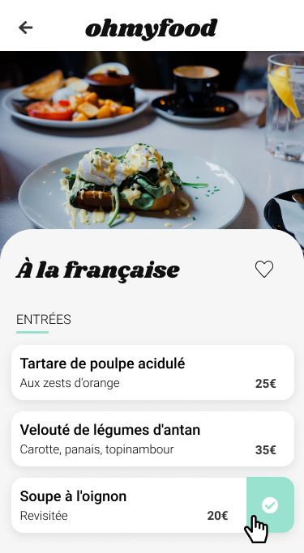

# OhMyFood! - reservation website

This is a solution to the OpenClassrooms project. [OpenClassrooms](https://openclassrooms.com/) is one of the largest online schools in Europe, based in Paris.

## Overview

### Screenshot

### The challenge

Users should be able to:

- See animations for interactive elements and during page load
- See a loading spinner while the page renders
- Navigate the website using interactive images and icons
- View the optimal layout for the website depending on their device's screen size

### Links

- Live Site URL: [See the live page here](https://kasia307584.github.io/oh_my_food-reservation-website/)

## My process

### Built with

- Sass & CSS/Sass animations
- Mobile-first workflow
- BEM methodology
- CSS3 Flexbox and Grid
- Semantic HTML5 markup

### What I learned

- `Sass` (e.g., variables for colors as `$color-primaire`, functions as `darken()` and `lighten()`)
- `CSS and Sass animations` (`@keyframes`, e.g., loading spinner and delayed element appearances during page load; `transitions`, e.g., heart coloring, checkbox appearance)
  - in animations, use mostly `transform` and `opacity` instead of `width` and `color`
- BEM methodology
- mobile-first workflow

### Continued development

- use more advanced Sass syntax to write more functionnal code
- make the animation on elements persist after clicking (e.g., heart, checkbox)
- change CSS class names from French to English
- rebuild the project in React and Bootstrap
